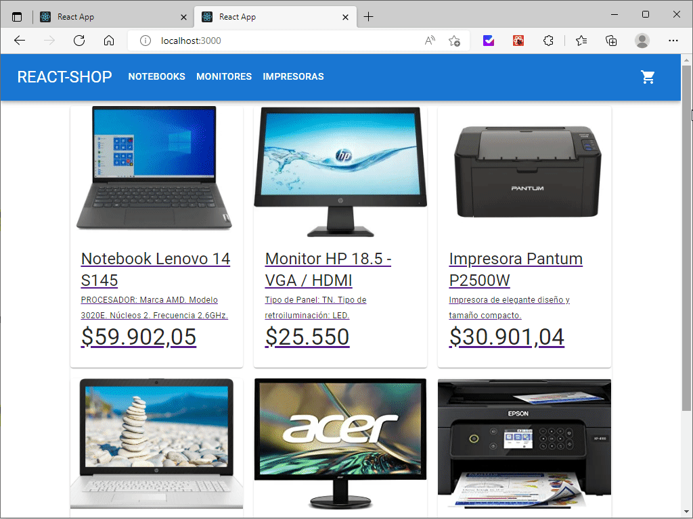

# Ecommerce REACT-SHOP

Tienda de insumos informáticos.



## Dependencias Descargadas

[Material UI](https://mui.com/).\
Utilizo Material UI para poder aprovechar el uso de sus componentes ya pulidos y asi poder ganar tiempo y enfocarme en el codigo. Todos sus componentes son atractivos visualmente y todos siguen una linea.

[React-Router-Dom](https://reactrouter.com/).\
Esta librería se encarga de administrar rutas dinámicas y fijas para asi lograr la navegabilidad por el sitio.

## Hooks Implementados

useState (React).\
Usado para generar estados locales al componente y tambien guardar esos estados para poder luego modificarlos.

useEffect (React).\
Usado para montar y hacer un render de los componentes solo cuando se los tiene que mostrar.

useParams (React-Router-Dom).\
Con useParams se detecta el parametro que le indicamos por la URL.

## Pasos para ver el proyecto en local

1. Desde la opcion Code copiamos el link HTTPS

2. En nustra terminal elegimos un lugar para clonar la carpeta y escribimos "git clone" + link que copiamos anteriormente

```
git clone https://github.com/mickro1985/shopreact-fabian-dario-ustares.git
```

3. Desde la terminal nos paramos en la carpeta raiz del proyecto e instalamos todos las dependencias que están dentro con "npm i"

```
npm i
```

4. Escribimos en la terminal "npm start" y se abrira el sitio en el navegador predeterminado.

```
npm start
```
